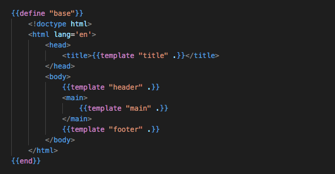

# Simple web app written in Go

Using Go `html/template` package for server-side rendering of html templates and [some sprinkles javascript](https://stimulus.hotwired.dev/) for client-side interactivity.


## Run application
First, create a `.env` file inside `/app` directory:

```
	$ 	cd app/ \
		touch .env \ 
		echo ADMIN="\"""\"" >> .env && \
		echo ADMIN_PASSWORD="\"""\"" >> .env
```

After adding your credentials in `.env` build the app directory:

`$ go build .`

Finally, exectute the resulting binary:

`$ ./app`

## Templates

The template files, ending in`.gtpl`, inside the `/ui` directory contain plain html, enriched with Go template tags to dynamically generate the UI.


The example below shows the definition of a *base* html template, that is populated with content defined in *title*, *header*, *main*, and *footer* templates. 



Refer to the [Go wiki](https://go.dev/doc/articles/wiki/) for more examples.

## Authentication

Users can log in with a username and password. After authentication session cookies are used to get access to private content.

For now, usernames and passwords are encrypted and stored in files, which are embedded in the binary. The admin password is used as a secret key for encryption/decryption of account data.

